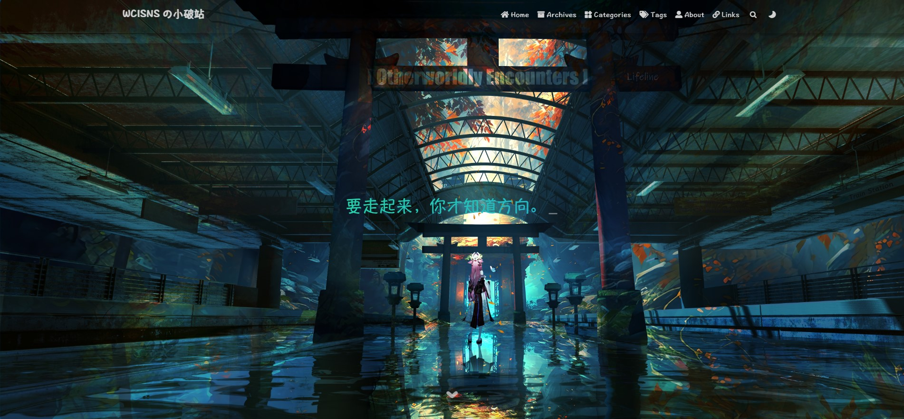
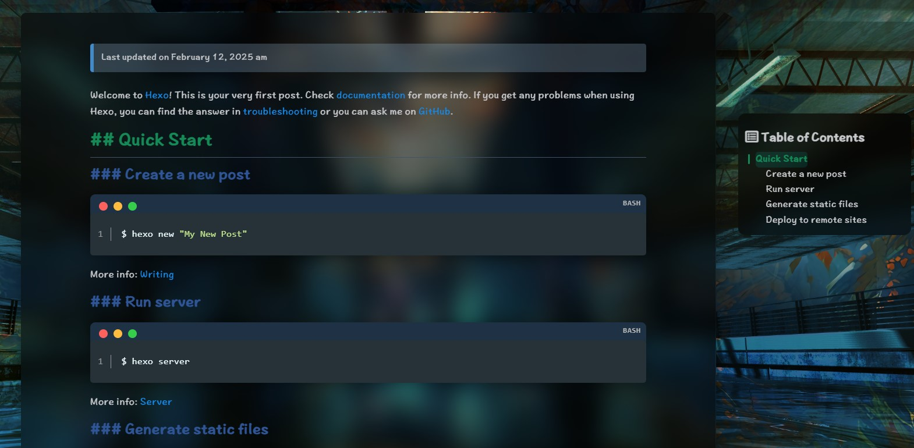

# hexo-theme-fluid

<p align="center">
  
</p>

<p align="center">一款 Material Design 风格的主题</p>
<p align="center">An elegant Material-Design theme for Hexo</p>





<p align="center">
  <span>预览：</span>
  <a href="https://wcisnsc.github.io/">wcisns's blog</a>
</p>

>  基于[fluid-dev/hexo-theme-fluid](https://github.com/fluid-dev/hexo-theme-fluid)主题配置一些样式

## 自定义内容

- 网站运行时间
- 亚力克内容背景样式
- 全局背景
- 标题样式
- 代码块样式
- 版本声明

## 快速开始

#### 1. 搭建 Hexo 博客

如果你还没有 Hexo 博客，请按照 [Hexo 官方文档](https://hexo.io/zh-cn/docs/) 进行安装、建站。

#### 2. 获取主题

```bash
git clone --depth=1 https://github.com/wcisnsc/hexo-theme-fluid.git themes/fluid
```

#### 3. 指定主题

如下修改 Hexo 博客目录中的 `_config.yml`：

```yaml
theme: fluid  # 指定主题

language: zh-CN  # 指定语言，会影响主题显示的语言，按需修改
```

在博客根目录创建 `_config.fluid.yml`，把主题目录的 `_config.yml` 内容复制进去

#### 4. 创建「关于页」

首次使用主题的「关于页」需要手动创建：

```bash
hexo new page about
```

创建成功后，编辑博客目录下 `/source/about/index.md`，添加 `layout` 属性。

修改后的文件示例如下：

```yaml
---
title: about
layout: about
---

这里写关于页的正文，支持 Markdown, HTML
```